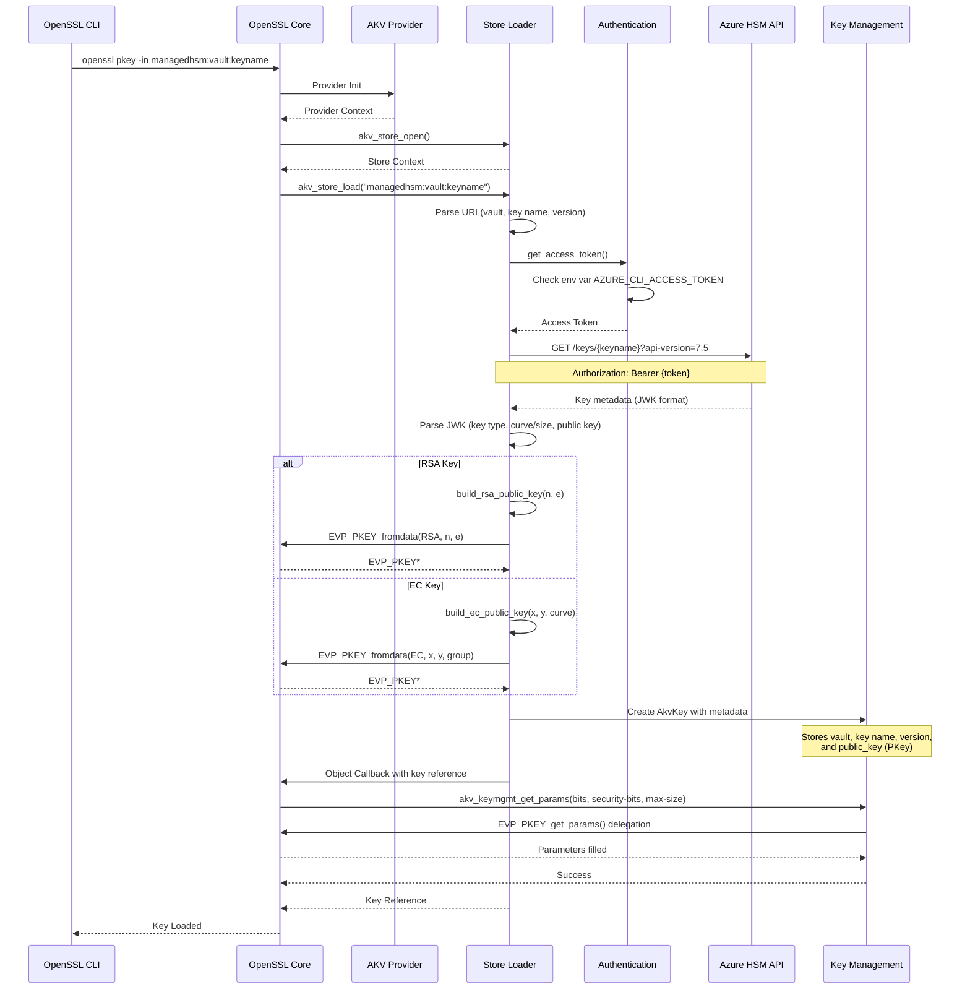
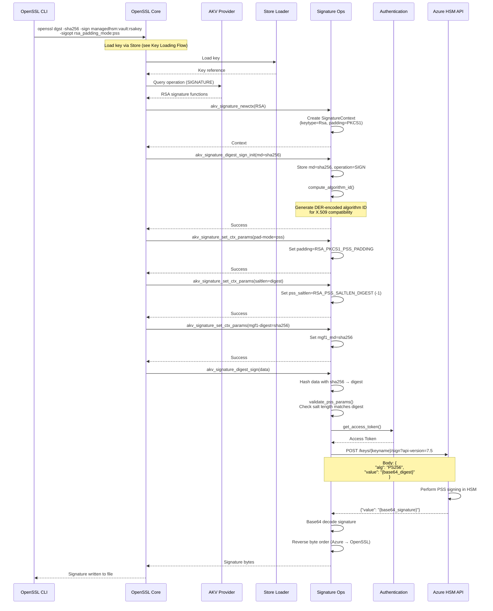
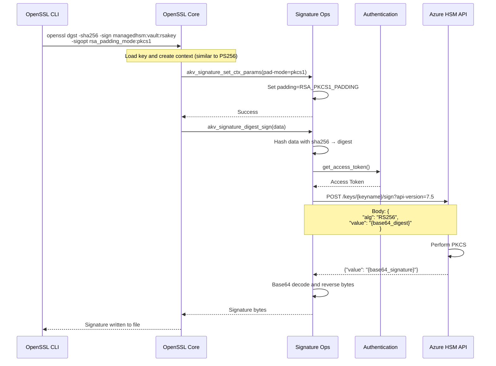
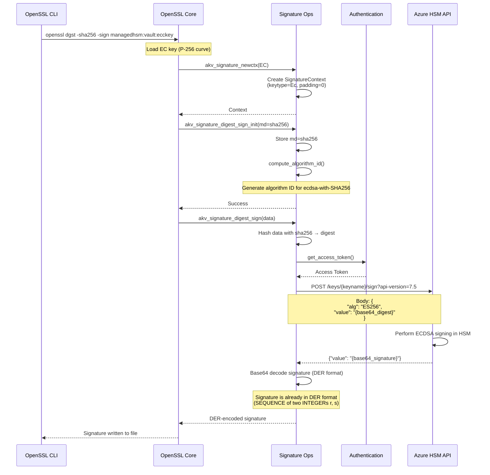
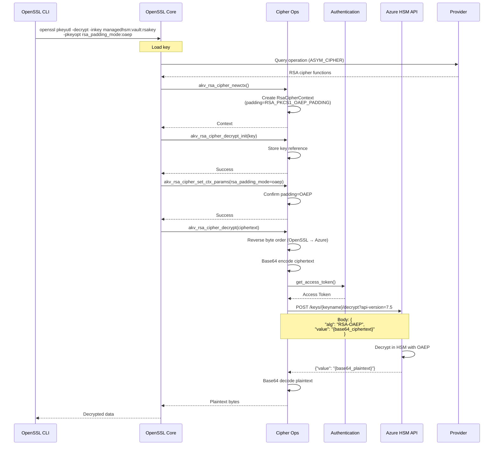
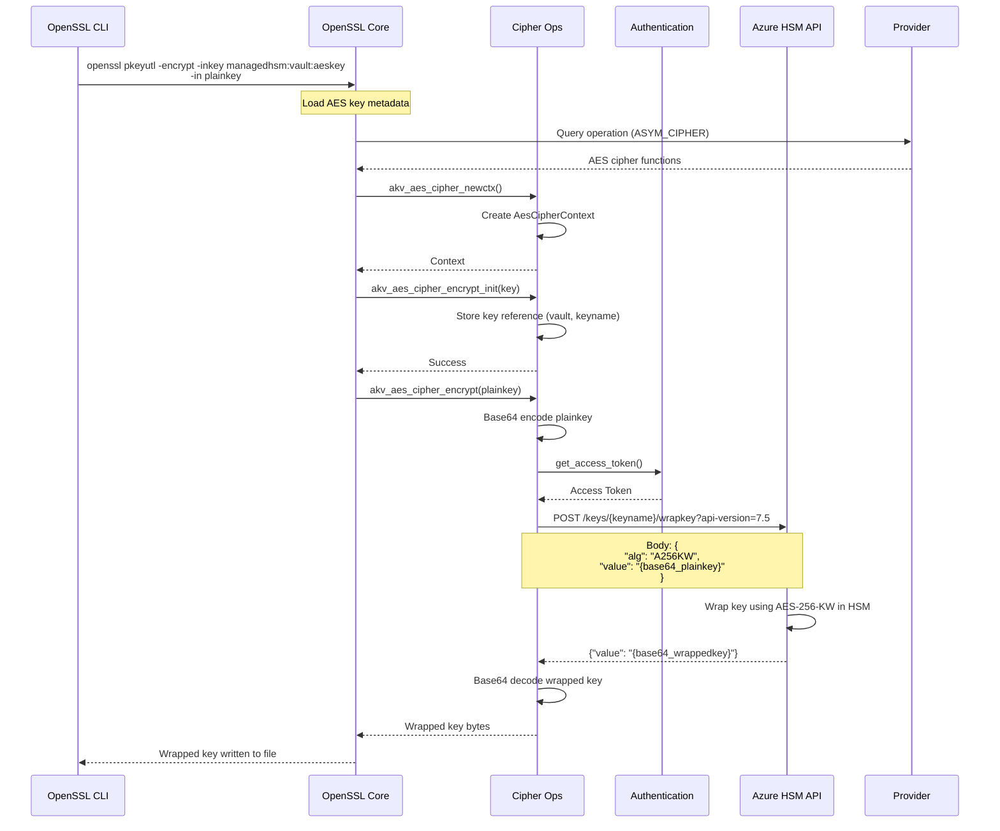
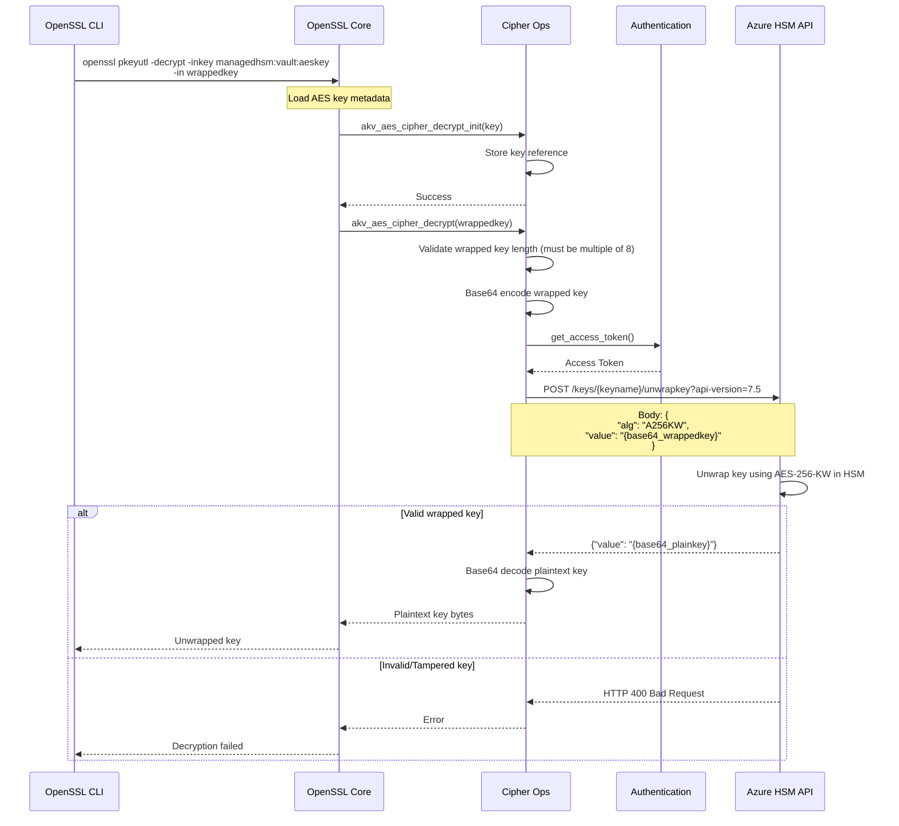
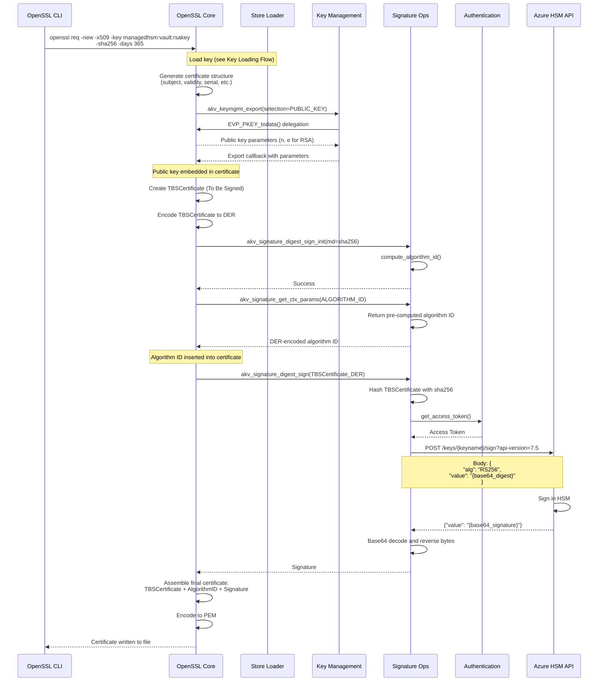
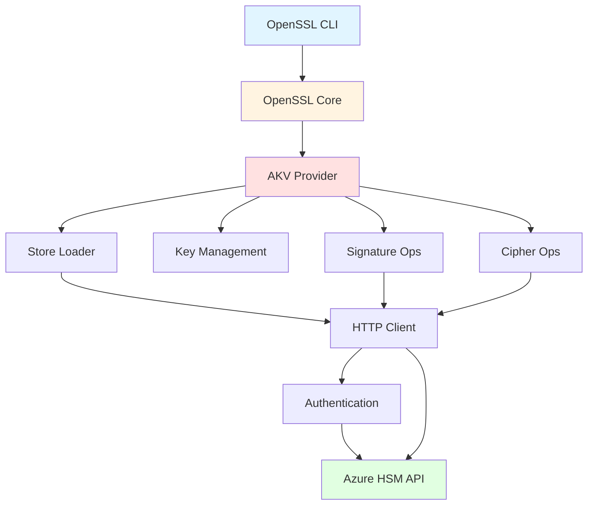

# Azure Managed HSM OpenSSL Provider - Architecture

This document provides detailed sequence diagrams showing how the OpenSSL provider interacts with OpenSSL, the Azure Managed HSM REST API, and handles various cryptographic operations.

## Table of Contents

1. [Overview](#overview)
2. [Key Loading Flow](#key-loading-flow)
3. [RSA Signing (PS256)](#rsa-signing-ps256)
4. [RSA Signing (RS256)](#rsa-signing-rs256)
5. [EC Signing (ES256)](#ec-signing-es256)
6. [RSA Decryption (OAEP)](#rsa-decryption-oaep)
7. [AES Key Wrap](#aes-key-wrap)
8. [AES Key Unwrap](#aes-key-unwrap)
9. [X.509 Certificate Generation](#x509-certificate-generation)

---

## Overview

The Azure Managed HSM OpenSSL Provider implements the OpenSSL 3.x Provider API to enable cryptographic operations using keys stored in Azure Managed HSM. The provider acts as a bridge between OpenSSL and Azure's REST API.

**Key Components:**
- **Store Loader**: Parses URIs and fetches keys from Azure Managed HSM
- **Key Management (KEYMGMT)**: Manages public key material and metadata
- **Signature**: Handles RSA and ECDSA signing operations
- **Cipher**: Handles RSA decryption and AES key wrap/unwrap
- **HTTP Client**: Communicates with Azure Managed HSM REST API
- **Authentication**: Manages Azure access tokens

### Supported Azure Managed HSM Operations

| Operation | Description |
|-----------|-------------|
| **Decrypt** | Decrypts a single block of encrypted data. |
| **Encrypt** | Encrypts an arbitrary sequence of bytes using an encryption key that is stored in a key vault. |
| **Wrap Key** | Wraps a symmetric key using a specified key. |
| **Unwrap Key** | Unwraps a symmetric key using the specified key that was initially used for wrapping that key. |
| **Sign** | Creates a signature from a digest using the specified key. |
| **Verify** | Verifies a signature using a specified key. |

**Note:** The provider currently implements Decrypt, Wrap Key, Unwrap Key, and Sign operations. Encrypt and Verify operations are performed locally by OpenSSL using the public key material.

**Reference:** [Azure Key Vault REST API Documentation](https://learn.microsoft.com/en-us/rest/api/keyvault/)

---

## Key Loading Flow

This diagram shows how a key is loaded from Azure Managed HSM when specified via a `managedhsm:` URI.

**Key Points:**
1. URI format: `managedhsm:{vault}:{keyname}[:{version}]`
2. Access token is retrieved from environment variable `AZURE_CLI_ACCESS_TOKEN`
3. Public key material is fetched from Azure and converted to OpenSSL `EVP_PKEY`
4. Private key operations are performed by the HSM; only metadata is stored locally

---

## RSA Signing (PS256)

RSA-PSS signing with SHA-256 digest and salt length equal to digest length.

**Key Points:**
1. PSS padding requires salt length equal to digest length for Azure HSM
2. MGF1 must use the same digest as the main signature digest
3. Signature bytes are returned in big-endian and reversed for OpenSSL
4. Algorithm identifier is pre-computed for X.509 CSR/certificate operations

---

## RSA Signing (RS256)

RSA PKCS#1 v1.5 signing with SHA-256 digest.

**Key Points:**
1. PKCS#1 v1.5 padding is simpler than PSS (no salt parameters)
2. Algorithm is RS256 (RSASSA-PKCS1-v1_5 with SHA-256)
3. Same byte order reversal applies

---

## EC Signing (ES256)

ECDSA signing with SHA-256 digest and P-256 curve.

**Key Points:**
1. EC signatures use DER encoding (no byte reversal needed)
2. Algorithm is ES256 (ECDSA with SHA-256 and P-256 curve)
3. No padding parameters for ECDSA

---

## RSA Decryption (OAEP)

RSA OAEP decryption using SHA-1 for both padding and MGF1.

**Key Points:**
1. Azure HSM uses RSA-OAEP with SHA-1 for both hash and MGF1
2. Ciphertext bytes are reversed before sending to Azure
3. Plaintext is returned directly in base64

---

## AES Key Wrap

Wrapping a symmetric key using AES-KW (RFC 3394).

**Key Points:**
1. AES key wrapping follows RFC 3394 (AES-KW)
2. Algorithm is A256KW (AES-256 Key Wrap)
3. Wrapped key is 8 bytes longer than plaintext (64-bit IV prepended)

---

## AES Key Unwrap

Unwrapping a symmetric key using AES-KW.

**Key Points:**
1. Unwrap validates the key integrity (detects tampering)
2. Wrapped key must be a multiple of 8 bytes
3. Returns HTTP 400 if wrapped key is invalid or tampered

---

## X.509 Certificate Generation

Generating a self-signed certificate or CSR using a key in Azure HSM.

**Key Points:**
1. Provider exports only public key material
2. Algorithm ID is pre-computed during `digest_sign_init`
3. TBSCertificate is hashed and signed by Azure HSM
4. Same flow applies to CSR generation (Certificate Signing Request)

---

## Component Interaction Summary

**Data Flow:**
1. **CLI → OpenSSL**: User commands and options
2. **OpenSSL → Provider**: Operation requests via provider API
3. **Provider → Azure**: REST API calls for cryptographic operations
4. **Azure → Provider**: Operation results (signatures, plaintext, etc.)
5. **Provider → OpenSSL**: Results converted to OpenSSL format
6. **OpenSSL → CLI**: Final output to user

---

## Security Considerations

1. **Private Keys Never Leave HSM**: All private key operations (sign, decrypt, unwrap) are performed in Azure HSM
2. **Access Token Security**: Tokens are obtained from environment variable and passed via HTTPS
3. **TLS Protection**: All communication with Azure uses HTTPS (TLS 1.2+)
4. **Token Expiry**: Access tokens typically expire after 1 hour; refresh externally
5. **Audit Logging**: Azure HSM logs all key operations for compliance

---

## Performance Characteristics

**Typical Latencies** (from test logs):
- Key loading: ~250-350ms (includes HTTPS round-trip to Azure)
- RSA signing: ~200-300ms per signature
- EC signing: ~200-250ms per signature
- RSA decryption: ~200-250ms per decrypt
- AES wrap/unwrap: ~150-200ms per operation

**Optimization Tips:**
- Reuse loaded keys when possible (provider caches public key material)
- Use batch operations for multiple signatures
- Consider key caching at application level for repeated operations

---

## Error Handling

Common error scenarios and how the provider handles them:

1. **Invalid URI**: Store loader returns error, OpenSSL reports "file not found"
2. **Missing Access Token**: Authentication fails, returns clear error message
3. **Key Not Found**: Azure API returns 404, provider reports key not found
4. **Invalid Parameters**: Provider validates parameters and returns specific error
5. **Network Errors**: HTTP client retries and reports connection issues
6. **HSM Unavailable**: Azure returns 503, operation fails with service unavailable

All errors are logged to the provider log file for debugging.
